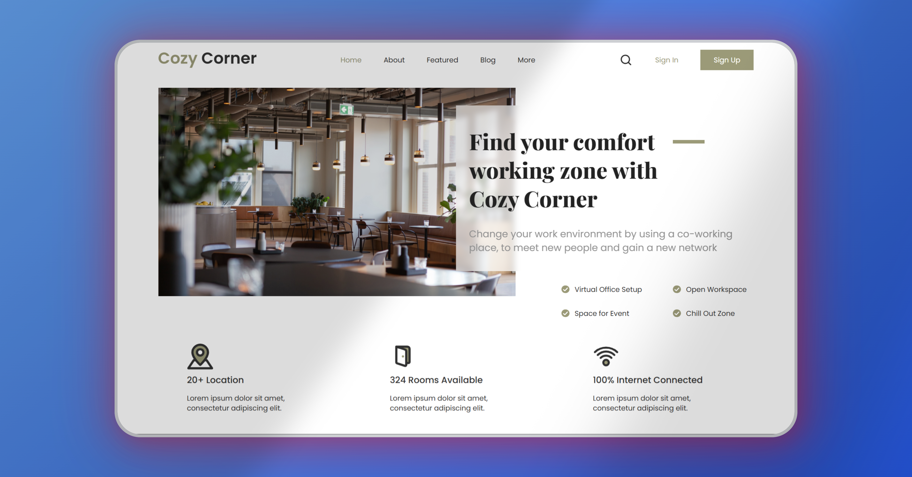

# Cozy Corner - Coworking Space Landing Page

Una landing page elegante y minimalista para un espacio de coworking, diseñada como ejemplo de proyecto HTML y CSS. Ideal para mostrar servicios y características de oficinas compartidas modernas.

## 📑 Tabla de Contenidos

- [Introducción](#introducción)
- [Características](#características)
- [Captura de Pantalla](#captura-de-pantalla)
- [Instalación](#instalación)
- [Uso](#uso)
- [Dependencias](#dependencias)
- [Personalización](#personalización)
- [Ejemplos](#ejemplos)
- [Contribuciones](#contribuciones)
- [Autor](#autor)
- [Licencia](#licencia)

## 🧩 Introducción

Este proyecto representa una sección inicial de un sitio web para espacios de coworking, donde se presentan los beneficios de trabajar en un entorno moderno, colaborativo y conectado. Está pensado como plantilla de ejemplo para desarrolladores front-end.

## ✨ Características

- Diseño limpio, profesional y responsivo
- Mensaje de bienvenida con llamada a la acción
- Sección de beneficios:
  - Más de 20 ubicaciones
  - 324 salas disponibles
  - Internet 100% conectado
- Servicios destacados:
  - Oficina virtual
  - Espacio para eventos
  - Zona chill out
  - Áreas abiertas de trabajo
- Barra de navegación superior: Home, About, Featured, Blog, More
- Botones: Sign In y Sign Up

## 🖼️ Captura de Pantalla



## 🚀 Instalación

1. Clona este repositorio:
```
git clone https://github.com/FrankJimenez79/coworking-space.git
```

2. Navega al directorio del proyecto:
```
cd coworking-space
```

3. Abre el archivo `index.html` en tu navegador.

## 🧪 Uso

Este diseño es ideal como punto de partida para sitios web de espacios de coworking, oficinas compartidas, emprendimientos o proyectos inmobiliarios tecnológicos.

## 📦 Dependencias

- HTML5
- CSS3
- No requiere frameworks ni librerías externas

## ⚙️ Personalización

Puedes modificar fácilmente:

- Textos y contenido en `index.html`
- Colores, tipografía y estilos en `style.css`
- Imágenes e íconos según tus necesidades

## 📚 Ejemplos

Ideal para presentaciones empresariales, portafolios de diseño web, landing pages de productos inmobiliarios o servicios de coworking.

## 🙌 Contribuciones

¡Se aceptan contribuciones! Abre un issue o pull request para mejorar este diseño o adaptarlo a otros casos de uso.

## 👨‍💻 Autor

Proyecto desarrollado por **Frank Jiménez** como ejemplo de página inicial para espacios de trabajo colaborativo.
